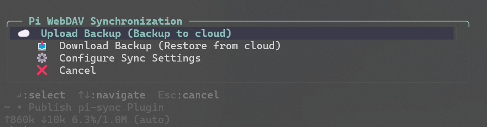

# pi-sync

**English** | [简体中文](./README.zh-CN.md)

[](https://github.com/earendil-works/pi-coding-agent)
[](./LICENSE)
[](https://github.com/wuyaos/pi-packages/releases)

WebDAV-based config sync for [Pi](https://github.com/earendil-works/pi-coding-agent) — backup and restore **models**, **settings**, **skills**, **extensions**, and **session projects** across machines.

Run `/sync`, pick an action from the menu. One machine uploads; another downloads and restores.

<p align="center">
  
</p>

<p align="center"><sub><b>Pi WebDAV Synchronization</b> — interactive menu after <code>/sync</code></sub></p>

## Why

If you run Pi on multiple PCs / WSL / servers, reinstalling models, skills, and extensions by hand is painful. `pi-sync` packages your agent home into a timestamped zip, uploads it to any WebDAV folder, and restores it with local safety backups.

## Install

Requires [Pi coding agent](https://github.com/earendil-works/pi-coding-agent) and a WebDAV endpoint (TeraCLOUD, 坚果云 / Jianguoyun, Nextcloud, ownCloud, self-hosted, …).

`pi-sync` is part of the [wuyaos/pi-packages](https://github.com/wuyaos/pi-packages) monorepo. Installing the whole repo loads every sub-package:

```bash
pi install git:github.com/wuyaos/pi-packages
```

To load **only** `pi-sync`, use the object form in `~/.pi/agent/settings.json`:

```json
{
  "packages": [
    {
      "source": "git:github.com/wuyaos/pi-packages",
      "extensions": ["pi-sync/extensions/*.ts"],
      "themes": []
    }
  ]
}
```

Then restart Pi or run `/reload`.

## Usage

Type **`/sync`** in Pi. There are no CLI subcommands — everything goes through the interactive menu:

| Menu item | What it does |
|-----------|----------------|
| ☁️ **Upload Backup (Backup to cloud)** | Zip current config and upload to WebDAV |
| 📥 **Download Backup (Restore from cloud)** | List remote backups, download one, restore with confirmation |
| ⚙️ **Configure Sync Settings** | WebDAV URL / user / password, and what to include |
| ❌ **Cancel** | Leave the menu |

Keyboard hints (as shown in the TUI): `↵` select · `↑↓` navigate · `Esc` cancel.

### First-time setup

```bash
# 1. Install
pi install git:github.com/wuyaos/pi-packages

# 2. Open the menu (first run starts the setup wizard if WebDAV is empty)
/sync

# 3. If needed: Configure Sync Settings
#    enter URL / user / password
#    tip: set password to $PI_WEBDAV_PASS and export that env var

# 4. On your main machine → Upload Backup (Backup to cloud)
# 5. On a new machine (after install + configure) → Download Backup (Restore from cloud)
```

### What gets synced

| Component | Default | Notes |
|-----------|---------|-------|
| Config | ON | `models.json`, `settings.json`, `auth.json` |
| Skills | ON | entire `~/.pi/agent/skills` |
| Extensions | ON | `~/.pi/agent/extensions` (the sync plugin itself is excluded from the zip) |
| Sessions | OFF | per-project session history under `~/.pi/agent/sessions/`; pick which projects to include under **Configure Sync Settings → Session Projects** |

Toggle any of these under **Configure Sync Settings**.

### Sessions (optional)

Session history is organized by project cwd under `~/.pi/agent/sessions/<projectDir>/`. The **Session Projects** submenu lists every project directory found on this machine and lets you check the ones you want to back up.

- Turn on **Backup Sessions** in **Configure Sync Settings**.
- Open **Session Projects** and toggle projects on/off (use **Select All** / **Reset list** for convenience).
- List mode (toggleable):
  - **Whitelist**: only checked projects are backed up; an empty list backs up **nothing**.
  - **Blacklist**: checked projects are skipped; an empty list backs up **everything**.
- On restore, session files are *merged* into the local `~/.pi/agent/sessions/` — session file names are unique (timestamp + uuid), so restoring never overwrites or deletes your local sessions.

> Note: project directory names encode the project path, so a backup made on one machine only restores into the same project path on another machine.

### Backup filename

Archives look like:

```text
pi_sync_backup_2026-7-14_20260714120000_windows11.zip
```

The trailing platform tag (`windows11` / `windows10` / `macos` / `linux`) shows which host created the backup.

### Safety on restore

- Existing config files get a timestamped `.bak` copy before overwrite
- Existing skills / extensions folders are renamed to `*-backup-<timestamp>` before replace/merge
- Restore shows a plan and asks for confirmation
- After a successful restore you can reload the agent runtime to apply skills/extensions

## Bootstrap (new Windows machine, no Pi yet)

If Pi is not installed yet, you can still pull the latest zip with the helper script:

```powershell
# Prefer env vars so secrets never land in shell history
$env:PI_WEBDAV_URL  = "https://your-webdav.example/dav/Pi"
$env:PI_WEBDAV_USER = "your-user"
$env:PI_WEBDAV_PASS = "your-app-password"
.\pi-bootstrap.ps1
```

Or one-liner placeholders (replace before running):

```powershell
$url="https://your-webdav.example/dav/Pi"; $user="your-user"; $pass="your-app-password"
$pair="$user`:$pass"; $auth=[Convert]::ToBase64String([Text.Encoding]::ASCII.GetBytes($pair))
$resp=Invoke-RestMethod -Uri $url -Method PROPFIND -Headers @{Authorization="Basic $auth";Depth="1"} -ContentType "application/xml"
$files=([regex]'<d:href>([^<]+)</d:href>').Matches($resp) | %{$_.Groups[1].Value} | ?{$_ -match "pi_sync_backup_.*\.zip$"} | Sort-Object -Descending
$latest=$files[0]; $name=Split-Path $latest -Leaf
Invoke-WebRequest -Uri "$url/$name" -Headers @{Authorization="Basic $auth"} -OutFile "$env:TEMP\$name"
```

Then install Pi and use **Download Backup** from `/sync` for future updates.

## Security

- WebDAV credentials are stored locally in `~/.pi/agent/sync_config.json`
- Prefer **app-specific passwords** (not your main account password)
- Prefer env-var references: set password to `$PI_WEBDAV_PASS` in the UI, then export that variable in your shell profile
- Backups may include `auth.json` / API keys if those options are enabled — treat the WebDAV folder as sensitive
- Never commit real WebDAV URLs with credentials into git

## Troubleshooting

| Symptom | Fix |
|---------|-----|
| HTTP 401 / 403 | Check user/password; use app password; confirm URL includes the correct DAV path |
| PROPFIND fails / empty list | Server may block PROPFIND; try another WebDAV provider; ensure Depth:1 is allowed |
| tar / zip errors | Need a working `tar` on PATH (Windows 10+ has one; Git Bash / WSL also fine) |
| Restore overwrote something | Look for `*.bak-*` files and `skills-backup-*` / `extensions-backup-*` folders next to the agent dir |
| Plugin missing after restore | Re-run `pi install git:github.com/wuyaos/pi-packages` — the sync package excludes itself from the archive |

## Structure

```text
pi-sync/
  package.json
  LICENSE
  README.md
  README.zh-CN.md
  pi-bootstrap.ps1
  docs/
    sync-menu.png       # /sync menu screenshot
  extensions/
    sync/
      index.ts          # /sync command
    _shared/
      json-io.ts
      enhanced-select.ts
      spawn.ts
      fetch-utils.ts
      box-drawing.ts
```

## Changelog

### v1.0.1

- Tag backup zip names with host platform (`windows11` / `macos` / `linux` / …)
- Remove example credentials from bootstrap script comments
- Add MIT `LICENSE` and expand README (security, restore safety, troubleshooting, menu screenshot)

### v1.0.0

- Initial public release: interactive `/sync` menu over WebDAV
  - Upload Backup · Download Backup · Configure Sync Settings
- Windows bootstrap helper script

## License

MIT — see [LICENSE](./LICENSE).

## Acknowledgements

This open-source project is linked and recognized by the [LINUX DO](https://linux.do) community.
